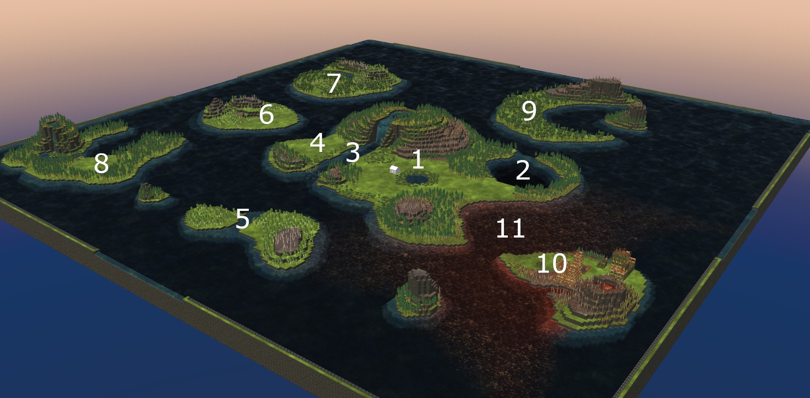

# Game Modding

## Timberborn
[{:class='icon icon-download'}](https://store.steampowered.com/app/1062090/Timberborn/){:target="_blank"}
[Steam Store](https://store.steampowered.com/app/1062090/Timberborn/){:target="_blank"}

A game about a post human world due to climate change where beavers are now the dominant species. The player builds a town with farms, industry, homes and entertainments in the goal to have a thriving community with a high well being score while not succumbing to the environment, hunger or thirst.

Timberbons game loop is about alternating seasons between temperate weather to either a drought or a [badtide](https://timberborn.wiki.gg/wiki/Weather#Badtide){:target="_blank"}
- In temperate weather water flows from sources and everything is nice and in bloom
- In a drought water stops flowing from sources and water on the map starts receding and crops wither
- In a [badtide](https://timberborn.wiki.gg/wiki/Weather#Badtide){:target="_blank"} water sources start pumping [badwater](https://timberborn.wiki.gg/wiki/Badwater){:target="_blank"} (toxic waste) which kills plants and makes your beavers sick on contact

---

## Red Tide Islands

[{:class='icon icon-download'}](https://mod.io/g/timberborn/m/red-tide-islands){:target="_blank"}
[Mod.io Download](https://mod.io/g/timberborn/m/red-tide-islands){:target="_blank"}

### Description

A custom game map created using games map editor

### Map Layout
1) A lush starting area with [berry patchs](https://timberborn.wiki.gg/wiki/Berries){:target="_blank"} for plentiful starting food and nearby trees and river
2) A deep water reservoir thats easy to damn for droughts and [badtides](https://timberborn.wiki.gg/wiki/Weather#Badtide){:target="_blank"} surrounded by a bounty of berries and trees for construction kept [irrigated](https://timberborn.wiki.gg/wiki/Fluids#Irrigation){:target="_blank"} through early droughts
- However, bad water (11) will start creeping towards the intake and toxicity will start or rise. A gentle challenge for the player to overcome and to start thinking about this maps meta

3) A short river to build industry and [water wheels](https://timberborn.wiki.gg/wiki/Water_Wheel){:target="_blank"} for power
4) An easy area to expand to for a early game farms and to be later replaced by industry
5/6) Nearby islands easy to expand to. Farming was in mind for these islands because of the damnable water sources for [irrigation](https://timberborn.wiki.gg/wiki/Fluids#Irrigation){:target="_blank"} and easy to clear foliage
7/8) Islands that can be reached through a relay from island (6). However this is quite far away from your starting area and provides an incentive to create a [second district](https://timberborn.wiki.gg/wiki/Districts){:target="_blank"}
- Both islands have a small water source and river to facilitate a [second district](https://timberborn.wiki.gg/wiki/Districts){:target="_blank"} or industry expansions
- Both islands have a clearing to telegraph a district build spot
- Both islands have a damnable water source for drinking water and [water wheels](https://timberborn.wiki.gg/wiki/Water_Wheel){:target="_blank"}
- Both islands have abundant trees for construction

9) An island to expand to from island (1) with forestry in mind. Trees are hard to clear but provide more wood than normal trees.
- The moon shaped bay is also possible to build a damn across but will be more challenging than other islands. The islands abundant trees will make local construction easier.

10) An old human outpost now in ruins
- [Badwater](https://timberborn.wiki.gg/wiki/Badwater){:target="_blank"} source to contain and harvest
- Mid game opportunity for scrap metal harvesting from ruins for metal production
- A [underground ruins](https://timberborn.wiki.gg/wiki/Underground_Ruins){:target="_blank"} entrance for a late game scrap metal mine

### The Challenge
- This is an opposite approach map which flips the [typical scenario](https://timberborn.wiki.gg/wiki/Maps){:target="_blank"} upside down
 - Typical maps are land locked with a shallow river running through it to provide horsepower for [water wheels](https://timberborn.wiki.gg/wiki/Water_Wheel){:target="_blank"} and water dries up during a drought
 - This map, water is abundant but current for water wheels is scarce
	- Water levels drops a bit but stays around during a drought due to the maps border
	- However, when a [badtide](https://timberborn.wiki.gg/wiki/Weather#Badtide){:target="_blank"} season comes the map is now flooded with [badwater](https://timberborn.wiki.gg/wiki/Badwater){:target="_blank"} that tends to linger longer than normal after the season increasing toxicity around you and creating challenging areas around all coast lines
	- This is a play on to much of a good thing and water water everywhere but not a drop to drink

### Design Choices
- A challenging map different that its competitors on 3rd party sites or [base game scenarios](https://timberborn.wiki.gg/wiki/Maps){:target="_blank"}
- Water is unusually abundant but becomes a primary antagonist in the maps progression as [badwater](https://timberborn.wiki.gg/wiki/Badwater){:target="_blank"} toxicity increases
- Progression:
	- Early Game:
		- Abundant resources and well flat, well telegraphed build spots
	- Mid Game:
		- Incentivizing islands nearby to expand to in range of your central district but pushing the travel distance limits
		- Players will experience their first [badtide](https://timberborn.wiki.gg/wiki/Weather#Badtide){:target="_blank"} and realize this map isnt as easy as one thought and a whole new problem is revealed when the [badwater](https://timberborn.wiki.gg/wiki/Badwater){:target="_blank"} doesnt dissipate easily
	- Late Game:
		- Multiple [district](https://timberborn.wiki.gg/wiki/Districts){:target="_blank"} are required for shortage of land and high travel distances
		- Logistics setup will be needed for trade between the islands
		- Water toxicity is quite high and solutions need to be implemented to protect anything on a coast line
