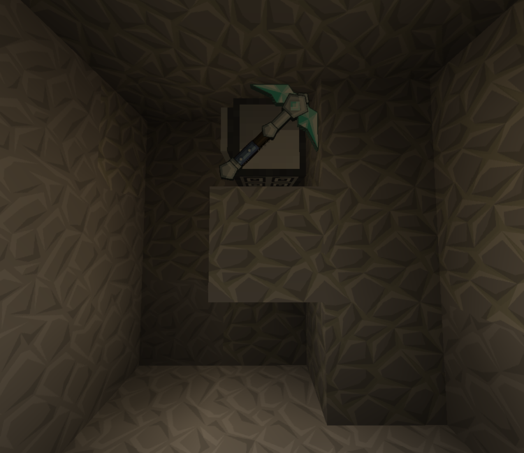
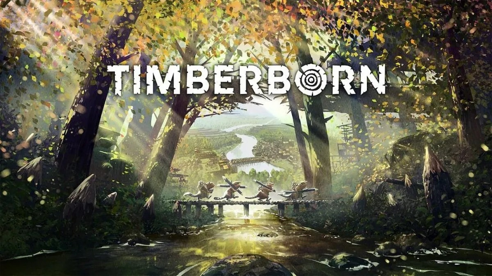

# Game Modding

[{:class='icon icon-download'}](https://www.minecraft.net/en-us/about-minecraft){:target="_blank"}
[Minecraft.net](https://www.minecraft.net/en-us/about-minecraft){:target="_blank"}

### Description of Game:

A game where the player collects resources and crafts a variety of items, structures and machines while exploring a block-based world. 

## CC Mine

[{:class='icon icon-download'}](https://github.com/Fenris42/CC-Mine){:target="_blank"}
[Github Repository](https://github.com/Fenris42/CC-Mine){:target="_blank"}

### Description:

A script for Minecraft mod [CC: Tweaked](https://www.curseforge.com/minecraft/mc-mods/cc-tweaked){:target="_blank"} a fork  of the popular mod [ComputerCraft](https://www.curseforge.com/minecraft/mc-mods/computercraft){:target="_blank"}.

CC: Tweaked adds basic [computers](https://www.computercraft.info/wiki/Computer){:target="_blank"} for programming, as well as [turtles](https://www.computercraft.info/wiki/Turtle){:target="_blank"} which are programmable robots, to the game. Scripts written in Lua, utilizing the [CC: Tweaked API](https://tweaked.cc/module/turtle.html){:target="_blank"} can perform a wide variety of tasks. In this case, mining.

### Features:
- Mines in a 3x3 block pattern.
- Ore blocks on tunnel walls are also mined.
	- Turtle scans the walls as it moves through the main tunnel, mining anything with “ore” in its name.
- Places a torch every 10 blocks.
- Floor and wall patching when required using cobblestone.
- Flooding detection in case you tunnel into a body of water or lava.
	- Turtle will move back and block the tunnel off using cobblestone to contain flooding.
	- If tunnel is above liquid level, a bridge will be created instead.
- Configurable junk filtering from inventory so you only bring back what you want.
- Returns to start position when inventory is full, out of fuel or tunnel flooding detected.

### Design Choices:
- Default tunnel program was very basic and was insufficient for my needs.
	- Tunnel was dug to a length input at start and did not return.
	- Completion resulted in having to go down a tunnel to retrieve the turtle.
	- The turtle did not stop if its inventory was full, and anything subsequently mined would be left on the ground.
	- Inventory would be mostly junk blocks like cobblestone and little ore.
	- The tunnel would be dark and full of monsters.
	
- I added the following functionality:
	- Auto torching to light up the tunnel and prevent monster spawns.
	- Patching of floor with cobblestone for easy traversal.
	- Patching of the walls when there was no block to place a torch on.
		- Later further improved to replace a gravity block like gravel with cobble first to prevent the torch falling off the wall if the block under it was mined.
	- Wrote enhanced dig function to continually dig and check until area was clear. This solved an issue where the turtle was digging into gravity blocks like gravel or sand.
	- A junk filter to drop blocks like cobblestone when inventory was full, then continue mining.
		- Later made a user customizable dynamic list.
	- Flood detection in case the turtle mines into a water or lava pocket.
		- The turtle will move back 3 blocks then build a wall to contain the leak.
	- Various checks for when the turtle was done, including:
		- Enough fuel on board to continue mining or to return home safely.
		- Flood detection.
		- Inventory full.
	- A report displayed on return that shows why the tunneling was finished.
	
### Retrospective:
- This was a very fun project and I will definitely write another turtle script in the future.
- I definitely experienced scope creep as development and testing went on, but I didn’t want this script to give me the same feeling of dissatisfaction that the default tunnel program left me with.
- In the end, I felt quite confident in what I had made. What was intended to be a personal program, I could now share with others. 

---

[{:class='icon icon-download'}](https://store.steampowered.com/app/1062090/Timberborn/){:target="_blank"}
[Steam Store](https://store.steampowered.com/app/1062090/Timberborn/){:target="_blank"}

### Description of Game:

A game about a world in which humans have died out due to climate change, and beavers are now the dominant species. The player aims for a high well-being score by building a town with farms, industry, housing and entertainment without succumbing to the environmental hazards, hunger or thirst.

Timberborn’s game loop involves seasons that alternate between temperate weather and either drought or [badtide](https://timberborn.wiki.gg/wiki/Weather#Badtide){:target="_blank"}.
- In temperate weather, water flows from sources and everything is in bloom.
- During a drought, water stops flowing from sources. Water on the map starts receding and crops wither.
- During a [badtide](https://timberborn.wiki.gg/wiki/Weather#Badtide){:target="_blank"}, water sources start pumping [badwater](https://timberborn.wiki.gg/wiki/Badwater){:target="_blank"} (toxic waste), which kills plants and makes your beavers sick on contact.

## Red Tide Islands

[{:class='icon icon-download'}](https://mod.io/g/timberborn/m/red-tide-islands){:target="_blank"}
[Mod.io Download](https://mod.io/g/timberborn/m/red-tide-islands){:target="_blank"}

### Description:

A custom game map created using the game's built-in map editor.

### Map Layout:
1) A lush starting area with [berry patches](https://timberborn.wiki.gg/wiki/Berries){:target="_blank"} for plentiful food, nearby trees for construction and a river for [water wheels](https://timberborn.wiki.gg/wiki/Water_Wheel){:target="_blank"}.

2) A deep water reservoir that's easy to dam. The dam keeps the surrounding bounty of berries and trees for construction [irrigated](https://timberborn.wiki.gg/wiki/Fluids#Irrigation){:target="_blank"} through early droughts.
- However, [badwater](https://timberborn.wiki.gg/wiki/Badwater){:target="_blank"} (11) will start creeping towards the intake, increasing water toxicity. This presents a gentle challenge for the player to overcome and encourages them to start thinking about this map’s meta.

3) A short river to build industry and [water wheels](https://timberborn.wiki.gg/wiki/Water_Wheel){:target="_blank"} for power.

4) An easy area to expand to for early game farms, to be later replaced by industry.

5/6)  Nearby islands easy to expand to. These islands were made with farming in mind, with their dammable water sources for [irrigation](https://timberborn.wiki.gg/wiki/Fluids#Irrigation){:target="_blank"} and easy to clear foliage.

7/8) Both of these islands can be reached through a relay from island (6). Since they are quite far away from your starting area, it provides an incentive to create a [second district](https://timberborn.wiki.gg/wiki/Districts){:target="_blank"}.

Both islands have:
- A small water source and river to facilitate a [second district](https://timberborn.wiki.gg/wiki/Districts){:target="_blank"} or industry expansions.
- A clearing as a telegraphed district build spot.
- A dammable water source for drinking water and light [water wheels](https://timberborn.wiki.gg/wiki/Water_Wheel){:target="_blank"}.
- Abundant trees for construction.

9) An island to expand to from island (1) with the purpose of forestry in mind. Trees are harder to clear but provide more wood than normal trees.
- The moon shaped bay can be dammed but it will be more challenging than other islands. The island's abundant trees will make local construction easier.

10) An old human outpost now in ruins.
- [Badwater](https://timberborn.wiki.gg/wiki/Badwater){:target="_blank"} source to contain and harvest.
- Mid-game opportunity to harvest scrap metal from ruins for metal production.
- An entrance to [underground ruins](https://timberborn.wiki.gg/wiki/Underground_Ruins){:target="_blank"} for a late game scrap metal mine.

### The Challenge:
- This is a map that flips the [typical scenario](https://timberborn.wiki.gg/wiki/Maps){:target="_blank"} upside down. [Typical maps](https://timberborn.wiki.gg/wiki/Maps){:target="_blank"} are landlocked with a shallow river running through them. Water is your most precious resource.
- In this map, water is abundant but current for [water wheels](https://timberborn.wiki.gg/wiki/Water_Wheel){:target="_blank"} is scarce.
- Water levels drop a bit but remain fairly steady during a drought due to the map’s border.
- However, because of these borders, a [badtide](https://timberborn.wiki.gg/wiki/Weather#Badtide){:target="_blank"} now floods the map with [badwater](https://timberborn.wiki.gg/wiki/Badwater){:target="_blank"} that lingers after the season, increasing toxicity and creating challenge areas around coastlines.
	- This is the turning point of the map and when the difficulties becomes clearer.

### Design Choices:
- To build a map different from those on [third party sites](https://mod.io/g/timberborn?tags-in=Map){:target="_blank"} or [base game scenarios](https://timberborn.wiki.gg/wiki/Maps){:target="_blank"}.
- Water is unusually abundant but it becomes a primary antagonist as the map progresses, due to increasing [badwater](https://timberborn.wiki.gg/wiki/Badwater){:target="_blank"} toxicity.
	- This is a play on “too much of a good thing” and “water, water, everywhere, but not a drop to drink’”

- Progression:
	- Early Game:
		- Abundant resources and flat build spots.
	- Mid Game:
		- Incentivizing expansion to islands near your central [district](https://timberborn.wiki.gg/wiki/Districts){:target="_blank"} while pushing the travel distance limits.
		- Players will experience their first [badtide](https://timberborn.wiki.gg/wiki/Weather#Badtide){:target="_blank"} and discover that this map isn't as easy as they thought. A whole new problem will be revealed when the [badwater](https://timberborn.wiki.gg/wiki/Badwater){:target="_blank"} doesn't dissipate easily.
	- Late Game:
		- Multiple [districts](https://timberborn.wiki.gg/wiki/Districts){:target="_blank"} are required due to shortage of land and long travel distances between them.
		- [Districts](https://timberborn.wiki.gg/wiki/Districts){:target="_blank"} and [trade](https://timberborn.wiki.gg/wiki/District_Crossing){:target="_blank"} will be needed between the islands.
		- Water toxicity is quite high and solutions need to be implemented to protect anything on a coastline or near a water source.
