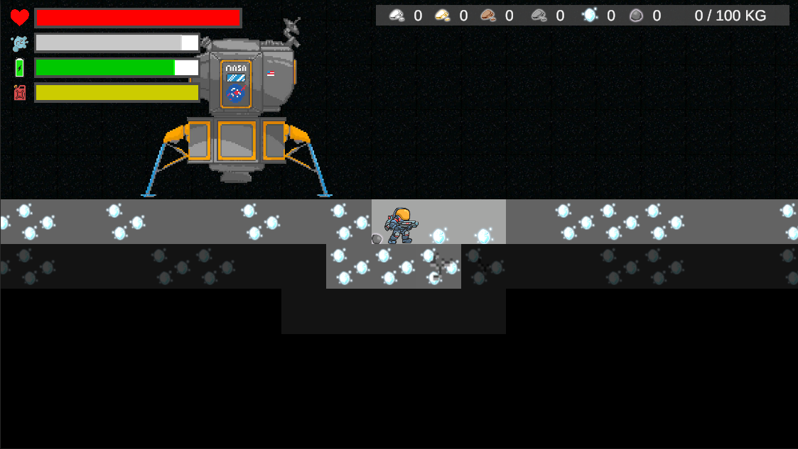
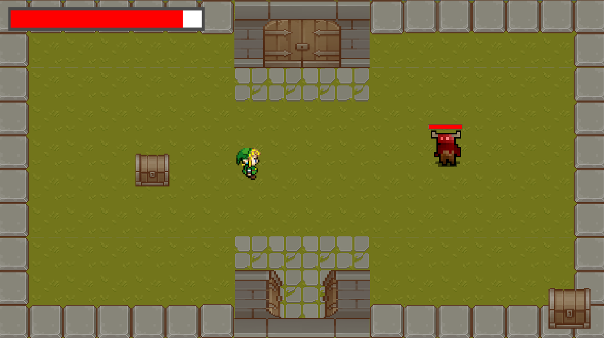
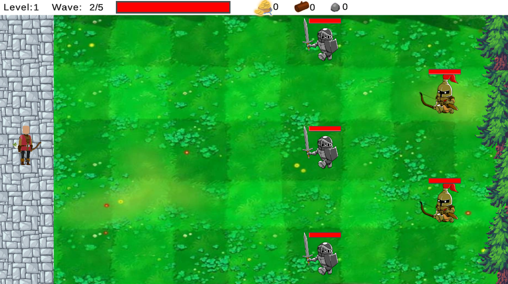
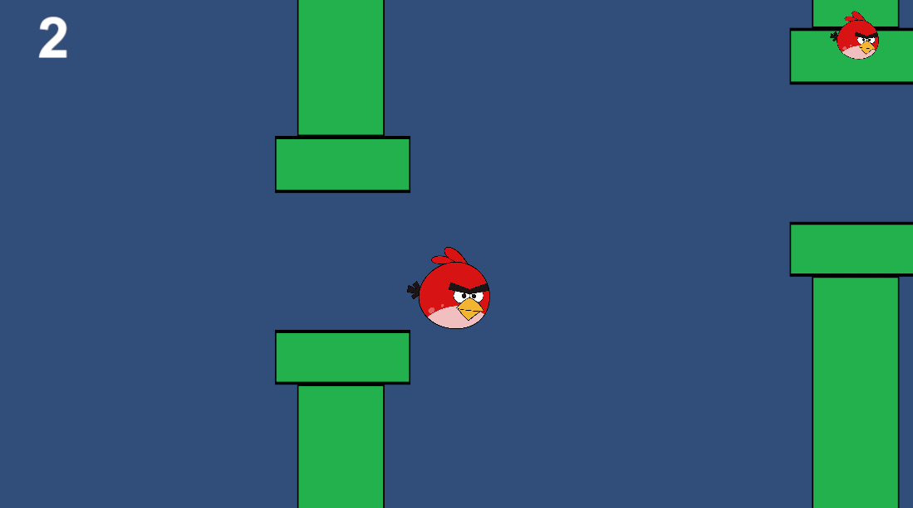

# Unity Projects

  <strong>Disclaimer:</strong> Games are not for sale or distribution. All artwork depicted are placeholders as I am not an artist and just experimenting with game development   

---

## Project Rock Hopper
{:class='icon icon-download'}
Private Github Repository

**Status:** Active

**Description:** 

A 2D side scrolling asteroid mining game. Mine resources while balancing life support and defending yourself from pirates. Cash in your loot at the local space station to upgrade your gear and ship

**Goals:**

{:class="icon"} Low gravity movement and jetpack flight

{:class="icon"} Dynamic digging using a tilemap

{:class="icon"} Dynamic light system using a tilemap

{:class="icon"} Procedural level generation

- Take off and land on asteroid from your parent ship in orbit
- Asteroid selection from map screen
- A space station hub for you to upgrade your gear, upgrade your ship, sell loot and get quests from
- Add pirate enemies to encounter on your travels

---

## Project Forest
[{:class='icon icon-download'}](https://github.com/Fenris42/Project_Forest){:target="_blank"}
[Github Repository](https://github.com/Fenris42/Project_Forest){:target="_blank"}

**Status:** Shelved  

**Description:**

A top down dungeon crawler RPG

**Goals:**

{:class="icon"} Implement levels using a tilemap

{:class="icon"} Movement and attacks in 4 directions

{:class="icon"} Mob AI that uses a single configurable template for class selection and attacks

{:class="icon"} Mob AI that tracks and reacts to players position and has collision avoidance

{:class="icon"} Procedural dungeon generation

{:class="icon"} A completed prototype

**Retrospective:**

- Had a hard time finding the fun and direction of the game
- Team was initially excited about project but in reality didnt have enough time to dedicate to the project
- Top down added more directions of travel and more freedom of design, however it increased programming complexity more than initially thought
- Asset store had limited selection of art for this camera angle
- Assets required more sprites and animations to cover front and back directions
- Camera angle made perspectives difficult to manage such as doors on the left, right and bottom of screen not looking right

---

## Project Sebastion
[{:class='icon icon-download'}](https://github.com/Fenris42/Project_Sebastion){:target="_blank"}
[Github Repository](https://github.com/Fenris42/Project_Sebastion){:target="_blank"}

**Status:** Shelved  

**Description:**

A wave and lane based protect the tower game

**Goals:**

{:class="icon"} First attempt at creating a game not from a tutorial or template

{:class="icon"} Multiple scenes

{:class="icon"} Instantiated enemies

{:class="icon"} Basic Mob AI to move to attack range and attack wall

{:class="icon"} Wave spawning system

{:class="icon"} Mobs dropped loot on death thats able to be retrieved by player

{:class="icon"} A completed prototype

**Retrospective:**

- Game shelved due to game team breaking up over creative differences and direction
- Game based on an out dated genre. However one that seemed accomplishable
- Mobs where completely seperate code bases and lead to duplicated code and difficulty updating across all enemies
- Learned to collaborate on game development through weekly meetings and daily chat messaging
- Used Github to collaborate through commits and get quick feedback after implementing each feature to not invest to much time and effort if something needed changes

---

## 2D Game Experiment
[{:class='icon icon-download'}](https://github.com/Fenris42/2D_Platformer_Experiment){:target="_blank"}
[Github Repository](https://github.com/Fenris42/2D_Platformer_Experiment){:target="_blank"}

**Status:** Complete  

**Description:**

My first indipendent "game" where I was prototyping in a sandbox style by implementing a variety of common game systems in preparation to start a real attempt at making a game. This was to allow myself to make mistakes and a mess care free in order to learn how to better implement them in the future while getting more familiar with game development.

**Goals:**

{:class="icon"} Character movement. Left, right, jump

{:class="icon"} Basic health system

{:class="icon"} Basic Mobs with simple AI and attack

{:class="icon"} Collision detection

{:class="icon"} Mob loot

{:class="icon"} Inventory system

**Retrospective:**

- Successfully implemented a variety of systems on my own and through referencing tutorials
- Gained a lot of knowledge quickly about game programming and identified areas for future improvement

---

## Flappy Borb
[{:class='icon icon-download'}](https://github.com/Fenris42/Flappy_Borb){:target="_blank"}
[Github Repository](https://github.com/Fenris42/Flappy_Borb){:target="_blank"}

**Status:** Complete  

**Description:**

- My very first Unity project and attempt at game developement
- Followed tutorial [The Unity Tutorial For Complete Beginners](https://youtu.be/XtQMytORBmM?si=leTh6QheRjBX62GI)

**Goals:**

{:class="icon"} Learn how to setup and use Unity

{:class="icon"} Learn how to setup and use Github

{:class="icon"} Learn basics of C#

{:class="icon"} Complete a basic prototype

{:class="icon"} Expand on tutorial and implement anything on my own to prove understanding

- Continued experimenting after tutorial with a life system

**Retrospective:**

- Game developement is fun and a lot less scary than first anticipated
- Learned basics of Unity
- Learned basics of Github
- Learned basics of C#
- Learned basics of game structures, scripts and components
