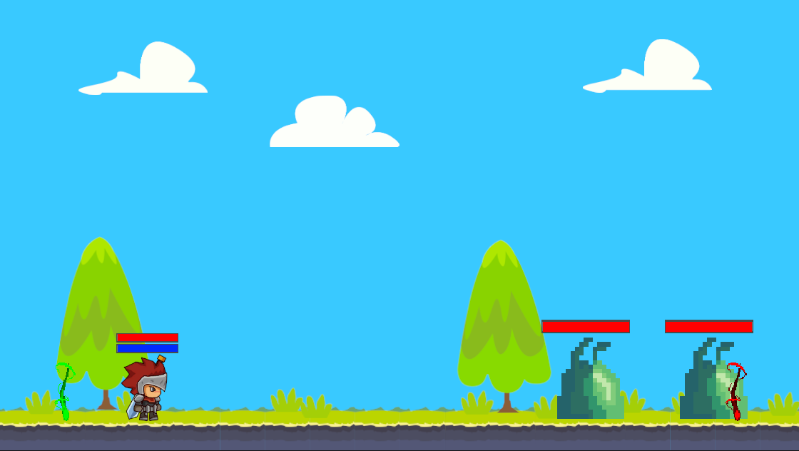

# Unity Projects

  <strong>Disclaimer:</strong> Games are not for selling or distribution. All artwork are placeholders as I am not an artist and just experimenting with game development   

## Project Rock Hopper

 Private Github Repository

**Status:** Active

A 2D asteroid mining game
* Procedural level generation
* Get as much loot as possible on your ventures out in space
* Dont run out of life support (Health, Oxygen, Energy, Fuel)
* You feel like you might not be alone

---

## Project Forest
**Status:** Shelved  
[{:class='icon icon-download'}](https://github.com/Fenris42/Project_Forest){:target="_blank"}
[Github Repository](https://github.com/Fenris42/Project_Forest){:target="_blank"}

A top down dungeon crawler RPG
* Implemented mob AI for multiple class configurations, player tracking and targeting solutions

---

## Project Sebastion
**Status:** Shelved  
[{:class='icon icon-download'}](https://github.com/Fenris42/Project_Sebastion){:target="_blank"}
[Github Repository](https://github.com/Fenris42/Project_Sebastion){:target="_blank"}

A lane based protect the tower game
* Wave based enemies
* Resource drop on mob death

---

## 2D Game Experiment
**Status:** Complete  
[{:class='icon icon-download'}](https://github.com/Fenris42/2D_Platformer_Experiment){:target="_blank"}
[Github Repository](https://github.com/Fenris42/2D_Platformer_Experiment){:target="_blank"}

My first indipendent game where I was experimenting with implementing a variety of common game systems in preparation to start a real attempt at making a game.

---

## Flappy Borb
**Status:** Complete  
[{:class='icon icon-download'}](https://github.com/Fenris42/Flappy_Borb){:target="_blank"}
[Github Repository](https://github.com/Fenris42/Flappy_Borb){:target="_blank"}

My very first Unity project and attempt at game developement
* Followed tutorial [The Unity Tutorial For Complete Beginners](https://youtu.be/XtQMytORBmM?si=leTh6QheRjBX62GI)
* Continued experimenting after tutorial with a life system and 3 lives
