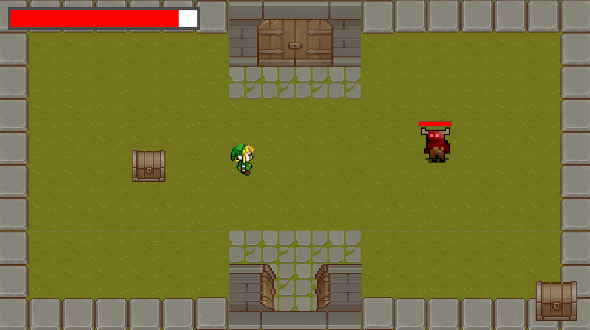

# Unity Projects
* Disclaimer: Games are not for selling or distribution. All artwork are placeholders as I am not an artist and just experimenting with game development   
 
 
 

## Project Rock Hopper (Private)
* Status: Active

A 2D asteroid mining game
* Procedural level generation
* Get as much loot as possible on your ventures out in space
* Dont run out of life support (Health, Oxygen, Energy, Fuel)
* You feel like you might not be alone

 
 

## [Project Forest (Public)](https://github.com/Fenris42/Project_Forest)
* Status: Shelved

A top down dungeon crawler RPG
* Implemented mob AI for multiple class configurations, player tracking and targeting solutions

 
 

## [Project Sebastion (Public)](https://github.com/Fenris42/Project_Sebastion)
* Status: Shelved

A lane based protect the tower game
* Wave based enemies
* Resource drop on mob death

 
 

## [2D Game Experiment (Public)](https://github.com/Fenris42/2D_Platformer_Experiment)
* Status: Complete

My first indipendent game where I was experimenting with implementing a variety of common game systems in preperation to start a real attempt at making a game.

 
 

## [Flappy Borb (Public)](https://github.com/Fenris42/Flappy_Borb)
* Status: Complete

My very first Unity project and attempt at game developement
* Followed tutorial [The Unity Tutorial For Complete Beginners](https://youtu.be/XtQMytORBmM?si=leTh6QheRjBX62GI)
* Continued experimenting after tutorial with a a life system and 3 lives

 
 
 
