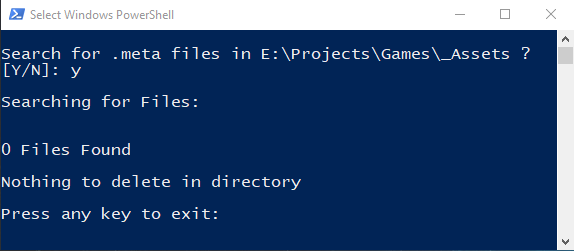

# Scripts

## [Delete Meta Files](https://github.com/Fenris42/Delete_Meta_Files){:target="_blank"}
* Language: Powershell

When downloading an asset pack from the Unity Asset Store I move it out of my Unity project and into a seperate local library of assets on my PC. I do this to only import files into my games that are required and to make browsing and reuse of assets easier.

However, Unity creates a .meta file for each folder and file in your Unity project which makes browsing the moved files in a file explorer miserable and requires a lot of clean up. This script will find and purge all .meta files in your local asset library to make browsing in a file explorer much more pleasent.